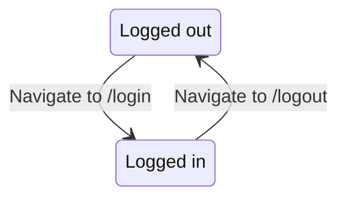
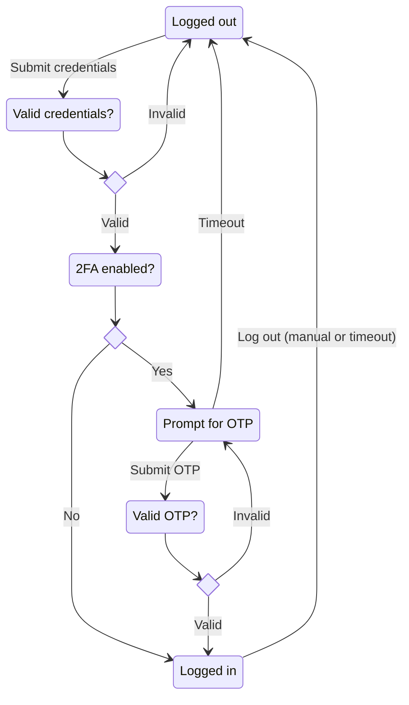

# State

## Automatic login machine (currently implemented)

To be able to test Hasura authorization without needing to repeatedly enter credentials, there is a state machine that automatically logs the developer in as userId: 1 when they navigate to `/login`. A mechanism like dependency injection could be added in later to make it easier to swap out different authentication implementations

## MFA state machine (prospective)

