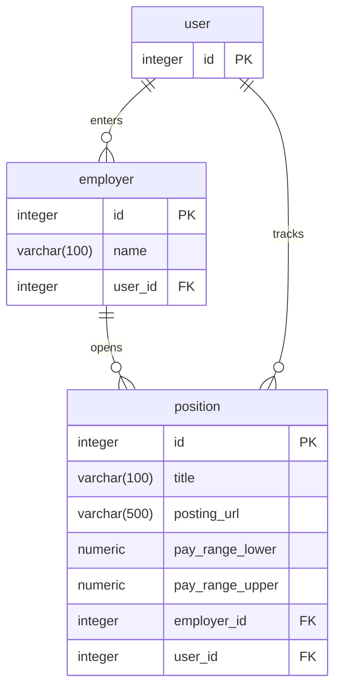

# Entity Relationships

```mermaid
erDiagram
    user {
        integer id PK
    }
    employer {
        integer id PK
        varchar(100) name
        integer user_id FK
    }
    position {
        integer id PK
        varchar(100) title
        varchar(500) posting_url
        numeric pay_range_lower
        numeric pay_range_upper
        integer employer_id FK
        integer user_id FK
    }

    employer                  || -- o{ position     : opens
    user                      || -- o{ employer     : enters
    user                      || -- o{ position     : tracks
```
