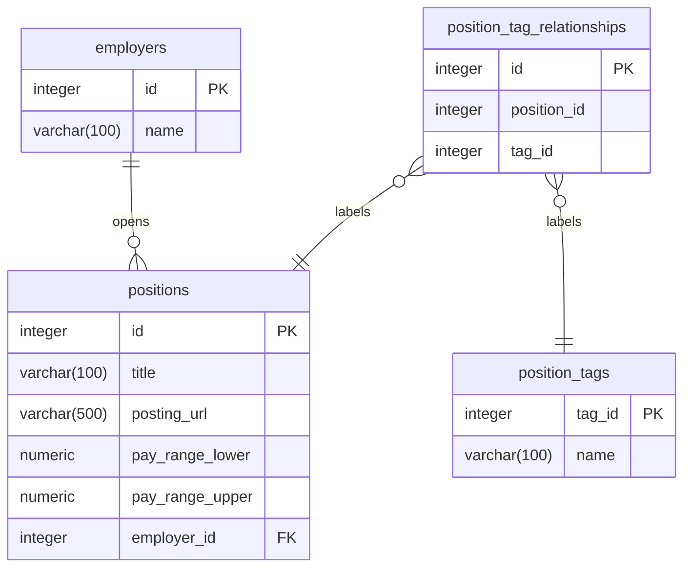

# Database

```mermaid
erDiagram
    employers {
        integer id PK
        varchar(100) name
    }
    positions {
        integer id PK
        varchar(100) title
        varchar(500) posting_url
        numeric pay_range_lower
        numeric pay_range_upper
        integer employer_id FK
    }
    position_tags {
        integer tag_id PK
        varchar(100) name
    }
    position_tag_relationships {
        integer id PK
        integer position_id
        integer tag_id
    }

    employers                  || -- o{ positions     : opens
    position_tag_relationships }o -- || positions     : labels
    position_tag_relationships }o -- || position_tags : labels
```
