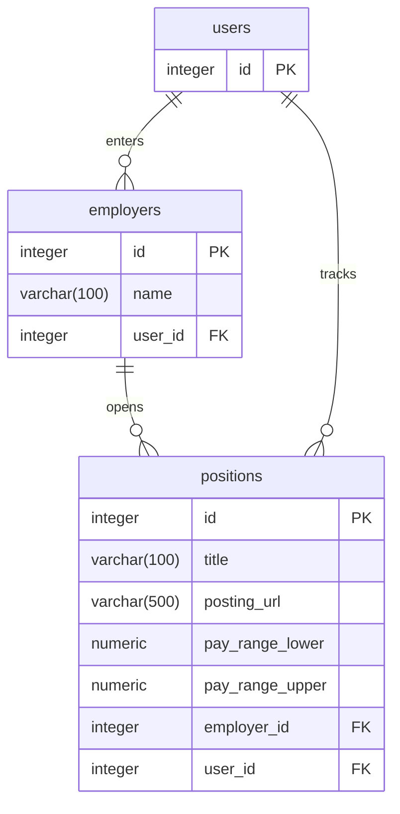

# Database

```mermaid
erDiagram
    users {
        integer id PK
    }
    employers {
        integer id PK
        varchar(100) name
        integer user_id FK
    }
    positions {
        integer id PK
        varchar(100) title
        varchar(500) posting_url
        numeric pay_range_lower
        numeric pay_range_upper
        integer employer_id FK
        integer user_id FK
    }

    employers                  || -- o{ positions     : opens
    users                      || -- o{ employers     : enters
    users                      || -- o{ positions     : tracks
```
